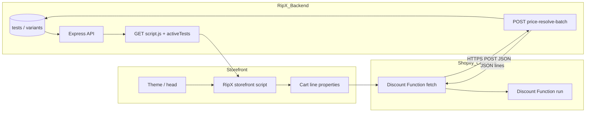

# Price test pipeline — research, ownership, and verification

This document maps **what RipX implements**, **what Shopify controls**, **what you (merchant/partner) must configure**, and **how to verify** each layer.

---

## 1. End-to-end data flow

1. **RipX DB** stores tests, variants, targeting (`target_ids`, `target_type`), status, personalization.
2. **`script.js`** embeds **minimal** `activeTests` (id, type, targets, optional JS targeting) — not full variant configs (those come from `/track/variants` or preview endpoints).
3. **Storefront script** assigns variant, applies **display** prices, writes **`_ripx_price_test`**, **`_ripx_variant`**, **`_ripx_shop`** on add-to-cart.
4. **Checkout** (Plus + network access): **Discount Function** reads line attributes + cost, **POSTs** to **`/api/track/price-resolve-batch`**, applies **fixed-amount** discounts from the response.

---

## 2. Layer table — implemented vs external

| Layer                                   | Implemented in RipX                                | External dependency                                 |
| --------------------------------------- | -------------------------------------------------- | --------------------------------------------------- |
| Tenant / shop registration              | `tenants`, install/OAuth                           | Partner account, app install                        |
| Active tests in script                  | `getActiveTestsForStorefront`                      | Test status / personalization mode                  |
| Variant assignment                      | `abTestEngine`, `/track/variants`                  | —                                                   |
| PDP / listing / cart **display** prices | `shopify/storefront-script.js`                     | Theme DOM, consent, script load position            |
| Draft **preview**                       | `/track/preview`, `/track/preview-storefront-test` | Correct `shop`/`site`, saved test                   |
| Batch **resolver**                      | `priceTestCheckoutResolve.js`, `trackRoutes`       | Valid body, secret if set                           |
| **Checkout discount**                   | `extensions/ripx-checkout-discount`                | **Shopify Plus**, network access, discount in Admin |
| Webhooks / sync for price tests         | Partial (`target_id` centric in some jobs)         | Full `target_ids` coverage = future hardening       |

---

## 3. What RipX added in code (recent / verification)

| Item                                                                                           | Purpose                                                                                                               |
| ---------------------------------------------------------------------------------------------- | --------------------------------------------------------------------------------------------------------------------- |
| `buildCheckoutPriceDiagnostics` + UI route                                                     | Single JSON for operators                                                                                             |
| Checklist **`batch_path_matches_ripx_handler`**                                                | Catches wrong `APP_URL` path or custom gateway typos                                                                  |
| Checklist **`extension_config_matches_env`** (+ **`extension_config_file`** if config missing) | Compares `extensions/.../ripxConfig.js` to `.env` (R5 drift); skip with `RIPX_DIAGNOSTICS_SKIP_EXTENSION_CONFIG=true` |
| `scripts/verify-price-pipeline.js`                                                             | CLI copy of diagnostics (optional DB shop counts via `RIPX_VERIFY_SHOP`)                                              |
| Storefront: preview merge, tenant params (`shop` vs `site`), preview PDP heuristics            | Draft preview + standalone parity                                                                                     |
| Theme embed `head` + `?v=` sync                                                                | Flicker / cache-bust alignment with Settings snippet                                                                  |

---

## 4. Step-by-step verification (recommended order)

| Step | Action                                                                    | Pass criteria                                         |
| ---- | ------------------------------------------------------------------------- | ----------------------------------------------------- |
| A    | `node scripts/verify-price-pipeline.js` (repo root, `.env` loaded)        | No `[✗]` lines; batch URL HTTPS                       |
| A′   | Same with `RIPX_VERIFY_SHOP=store.myshopify.com` (DB up)                  | `tenant_registered: true`; note `running_price_tests` |
| B    | App running: `GET /api/track/price-checkout-diagnostics?shop=…`           | Same JSON as A + shop block                           |
| C    | RipX UI: **Store settings → Advanced** (checkout diagnostics)             | Same checks without CORS issues                       |
| D    | Browser on storefront: `script.js` 200, `AB_TEST_RUNTIME_CONFIG`          | `apiUrl`, `shopDomain`, expected `activeTests`        |
| E    | PDP + running **product** price test                                      | Display price matches variant logic                   |
| F    | Cart: line **properties** `_ripx_*`                                       | All three present                                     |
| G    | (Plus only) `shopify:checkout-discount:prepare` + deploy + Admin discount | Checkout line total matches test                      |

---

## 5. What remains (product / engineering backlog)

These are **known gaps or enhancements**, not blockers for basic storefront price tests:

| ID  | Item                                                              | Notes                                                                                                                                                                            |
| --- | ----------------------------------------------------------------- | -------------------------------------------------------------------------------------------------------------------------------------------------------------------------------- |
| R1  | Webhook / `productSyncProcessor` **multi-product** (`target_ids`) | Some paths still key on single `target_id`                                                                                                                                       |
| R2  | **Collection-only** price tests at checkout                       | By design: function resolves **product** targets; collection = storefront-first                                                                                                  |
| R3  | **Anti-flicker** beyond head+defer                                | Optional inline stub / CSS (merchant theme tradeoffs)                                                                                                                            |
| R4  | Automated **E2E** against live Shopify checkout                   | Needs Plus sandbox + CI secrets                                                                                                                                                  |
| R5  | **ripxConfig.js** drift detection                                 | **Implemented:** diagnostics + verify script read `src/ripxConfig.js` and compare batch URL + secret to server `.env`. Optional: CI job that fails on drift in locked-down envs. |

---

## 6. What **you** must provide (cannot be automated in repo)

Check these manually or via Partner Dashboard / Shopify Admin:

- [ ] **Shopify Partner** app created; **same** `client_id` as `.env` / `shopify.app.toml`
- [ ] **App Proxy**: prefix `apps`, subpath `ripx`, URL points to RipX **`/api/proxy/script.js`** (or your documented path)
- [ ] **Theme**: **RipX App Embed** on (or equivalent snippet in `<head>`)
- [ ] **Production `APP_URL`**: stable HTTPS host reachable from **internet** (Shopify Functions call **your** API)
- [ ] **Production**: `RIPX_CHECKOUT_PRICE_SECRET` set; run `npm run shopify:checkout-discount:sync-config`; **rebuild + deploy** extension
- [ ] **Plus** (for checkout): plan + **Discount network access**; automatic discount using **RipX** function
- [ ] **Catalog**: variant price ≥ max test price when discounting **down** at checkout
- [ ] **Price tests**: **running** (or rollout/personalized); **product** `target_ids` for checkout alignment
- [ ] **Legal / consent**: `RIPX_CONSENT_REQUIRED` aligned with storefront CMP, if used

---

## 7. Related files

| File                                               | Role                         |
| -------------------------------------------------- | ---------------------------- |
| `backend/docs/PRICE_TEST_READINESS_CHECKLIST.md`   | Merchant-facing checklist    |
| `extensions/ripx-checkout-discount/README.md`      | Function build & Admin steps |
| `shopify/storefront-script.js`                     | Storefront behavior          |
| `backend/src/services/priceTestCheckoutResolve.js` | Resolver rules               |
| `scripts/verify-price-pipeline.js`                 | Local / CI config smoke      |
| `scripts/write-ripx-checkout-config.js`            | Sync extension env           |

---

_Last updated with pipeline diagnostics and verify script; extend R1–R5 as work completes._
