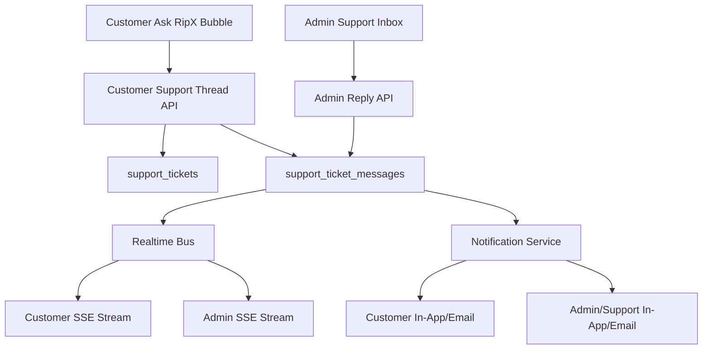

# CustomerSupport Chat Thread Plan

**Purpose:** Define the best implementation path for a WhatsApp-like CustomerSupport chat inside RipX, where customers can chat directly with admins/support users, messages are stored, support users are notified, and the thread remains available from the Ask RipX bubble, Support page, and Admin panel.

---

## 1. Goal

Build CustomerSupport as a real support-thread chat, not an email-style form.

Target behavior:

- Customer opens Ask RipX → CustomerSupport.
- Customer sends a message.
- RipX creates or continues a support ticket thread.
- Admin/support users are notified.
- Admin/support users reply from Admin Support Tickets.
- Customer receives the reply in the same chat thread.
- Full chat history is stored and available later.
- The experience feels similar to WhatsApp-style chat, while still using RipX support tickets as the durable record.

---

## 2. Current Foundation

RipX already has these pieces:

| Capability                           | Current status                            | Files                                                                                                      |
| ------------------------------------ | ----------------------------------------- | ---------------------------------------------------------------------------------------------------------- |
| Support tickets                      | Implemented                               | `backend/migrations/047_support_tickets.sql`, `backend/src/routes/supportRoutes.js`                        |
| Thread messages                      | Implemented                               | `backend/migrations/053_support_ticket_messages.sql`, `backend/src/services/supportTicketThreadService.js` |
| Customer thread API                  | Implemented                               | `GET /api/support/tickets/:id/thread`, `POST /api/support/tickets/:id/thread/reply`                        |
| Customer SSE stream                  | Implemented                               | `GET /api/support/tickets/:id/thread/stream`                                                               |
| Admin thread API                     | Implemented                               | `GET /api/admin/support-tickets/:id/thread`, `POST /api/admin/support-tickets/:id/reply`                   |
| Admin SSE stream                     | Implemented                               | `GET /api/admin/support-tickets/:id/thread/stream`                                                         |
| Admin UI                             | Implemented                               | `frontend/src/components/Admin/AdminSupportTickets.jsx`                                                    |
| Ask RipX CustomerSupport mode        | Partially implemented                     | `frontend/src/components/Assistant/RipxAssistantWidget.jsx`                                                |
| Email on ticket create               | Implemented                               | `backend/src/routes/supportRoutes.js`, `backend/src/services/emailService.js`                              |
| External inbox sync on ticket create | Implemented                               | `backend/src/services/supportInboxIntegrationService.js`                                                   |
| In-app notifications infra           | Implemented but not wired to support chat | `backend/src/services/notificationService.js`, `backend/src/routes/notificationRoutes.js`                  |

---

## 3. Current Gap

The current CustomerSupport mode is close, but not fully WhatsApp-like yet.

Gaps:

- Ask RipX CustomerSupport uses polling/refresh, not the existing SSE stream.
- Admin/support users are not strongly notified when a customer sends a thread reply.
- Customers are not strongly notified when admin/support replies.
- There is no unread/read state per participant.
- Realtime event bus is in-memory only, so it only works reliably on one backend process.
- Support users are treated as admins broadly, not as a dedicated support role/permission group.
- Email notifications exist for ticket creation, but not for every thread reply.
- External helpdesk sync appears ticket-create focused, not reply-sync focused.

---

## 4. Recommended Architecture

Use `support_tickets` as the conversation container and `support_ticket_messages` as the single message history.

Design rules:

- Keep human support chat separate from AI chat persistence.
- AI can summarize/escalate into a support ticket, but the human thread lives in `support_ticket_messages`.
- Do not create a second chat table for human support.
- Do not rely only on email for chat delivery.
- Keep email as a fallback notification channel.

---

## 5. Customer UX

### Ask RipX Bubble

CustomerSupport mode should behave like this:

1. If no active thread:
   - Show starter prompts.
   - User sends first message.
   - Backend creates a support ticket.
   - First message becomes the thread seed.
   - Bubble shows `Connected to CustomerSupport #abcd1234`.

2. If active thread:
   - Show message history.
   - User sends replies into the same ticket thread.
   - Admin/support replies stream into the same chat window.
   - Show status: `Live`, `Reconnecting`, or `Offline`.

3. If customer closes and reopens:
   - Load latest active support ticket/thread where possible.
   - Or offer `Open MyRequests`.

### Support Page

Support page should remain the full support hub:

- `CustomerSupport` path opens or continues the same thread.
- `MyRequests` shows historical threads.
- The thread modal should reuse the same shared hook as the Ask RipX bubble.

---

## 6. Admin / Support User UX

Admin/support users should work from Admin Support Tickets:

- New customer message appears in the ticket queue.
- Ticket row shows unread/customer-waiting status.
- Admin opens thread.
- Admin replies.
- Reply is stored in `support_ticket_messages`.
- Customer receives reply in Ask RipX/SSE and/or notification/email.

Future improvement:

- Dedicated support-agent role and permission such as `admin:support:reply`.
- Support-only admin workspace with no unrelated platform admin access.

---

## 7. Notification Design

### Notify admins/support users when customer sends a message

On customer message:

- Create admin/support notification:
  - title: `New CustomerSupport message`
  - message: ticket subject or customer snippet
  - data: `{ ticket_id, shop_domain, source: "customer_support_chat" }`
- Optionally email `SUPPORT_EMAIL_TO`.
- If assigned user exists, notify assigned user first.
- If unassigned, notify support queue.

### Notify customer when admin/support replies

On admin reply:

- Create customer/shop notification if `shop_domain` exists.
- Send email to ticket email if configured.
- Emit SSE message to active customer thread.

Important:

- Do not email every fast message forever without controls.
- Add throttling or digest settings later.
- MVP can email all admin replies because volume is low.

---

## 8. Realtime Delivery

### Current

`supportTicketThreadService.js` uses process-local `EventEmitter`.

This is fine for local and single-instance deployment.

### Production-ready

Replace or extend with shared pub/sub:

Options:

1. Redis Pub/Sub
   - Best fit if `REDIS_URL` is available.
   - Publish on message create.
   - Each Node instance subscribes and forwards to connected SSE clients.

2. Postgres `LISTEN/NOTIFY`
   - Good if avoiding Redis.
   - Lightweight.
   - Needs one persistent DB listener connection.

3. WebSocket
   - More complex than needed.
   - Not necessary if SSE is enough.

Recommendation:

- Keep SSE.
- Add Redis Pub/Sub as production bus.
- Fallback to in-process EventEmitter when Redis is missing.

---

## 9. Data Model Improvements

Current core tables are enough for MVP.

Recommended additions:

### `support_ticket_participants`

Tracks read state per customer/admin/support user.

Suggested fields:

- `id`
- `ticket_id`
- `participant_type`: `customer | admin | support`
- `participant_id`
- `participant_email`
- `last_read_message_id`
- `last_read_at`
- `created_at`
- `updated_at`

### `support_tickets` additions

Optional denormalized fields:

- `last_message_at`
- `last_message_sender_type`
- `message_count`
- `customer_unread_count`
- `staff_unread_count`

These make admin inbox faster and easier to sort.

---

## 10. Backend Implementation Plan

### Phase 1: Make current thread chat real-time in Ask RipX

Files:

- `frontend/src/components/Assistant/RipxAssistantWidget.jsx`
- `frontend/src/components/Support/Support.jsx`
- `backend/src/routes/supportRoutes.js`

Tasks:

- Replace 15-second polling in Ask RipX with `EventSource` after ticket is created.
- Reuse the same SSE logic as Support page thread modal.
- Show stream states:
  - `Live`
  - `Connecting`
  - `Reconnecting`
  - `Offline`
- Keep manual refresh as fallback.

### Phase 2: Thread reply notifications

Files:

- `backend/src/routes/supportRoutes.js`
- `backend/src/routes/adminRoutes.js`
- `backend/src/services/notificationService.js`
- `backend/src/services/emailService.js`

Tasks:

- On customer reply:
  - notify support/admin queue
  - optionally email `SUPPORT_EMAIL_TO`
  - audit customer reply
- On admin reply:
  - notify customer/shop
  - email customer
  - audit admin reply already exists

### Phase 3: Shared support thread hook

Files:

- `frontend/src/hooks/useSupportThread.js` or `frontend/src/components/Support/useSupportThread.js`
- `frontend/src/components/Assistant/RipxAssistantWidget.jsx`
- `frontend/src/components/Support/Support.jsx`
- `frontend/src/components/Admin/AdminSupportTickets.jsx`

Tasks:

- Extract load/reply/SSE/upsert logic into a reusable hook.
- Use same behavior in:
  - Ask RipX CustomerSupport mode
  - Support page MyRequests thread modal
  - Admin Support thread modal

### Phase 4: Unread state

Files:

- new migration
- `supportTicketThreadService.js`
- `supportRoutes.js`
- `adminRoutes.js`

Tasks:

- Add participant/read state table.
- Mark read on opening a thread.
- Show unread count in:
  - Ask RipX bubble
  - Support page MyRequests
  - Admin support list
  - TopBar notifications if shop-scoped

### Phase 5: Production realtime bus

Files:

- `supportTicketThreadService.js`
- possibly `backend/src/config/redis.js` or new support realtime service

Tasks:

- Add Redis Pub/Sub when `REDIS_URL` exists.
- Publish all support thread messages to Redis.
- Each process subscribes and forwards to local SSE clients.
- Fall back to `EventEmitter` for local dev.

---

## 11. Frontend UX Plan

### Ask RipX CustomerSupport mode

Better layout:

- Header: `CustomerSupport`
- Status pill: `Live` / `Reconnecting` / `Offline`
- If no thread:
  - starter prompts
  - composer
  - short note: “First message starts a support thread”
- If thread exists:
  - thread ID chip
  - message list
  - composer
  - refresh button only when offline/reconnecting

### Message bubbles

Customer:

- right side
- cyan/violet soft background
- label `You`

Support/admin:

- left side
- neutral card
- label from `sender_label`
- optional “Support” badge

System:

- centered small pill
- for events such as “Thread created”

---

## 12. Admin Notification Plan

Admin/support users should know immediately when a customer sends a message.

MVP:

- update ticket `updated_at`
- ticket appears higher in Admin Support Tickets list
- email `SUPPORT_EMAIL_TO`
- optional in-app admin notification if admin notification system is extended

Better:

- `staff_unread_count`
- “Customer waiting” badge
- browser toast/admin sound in `AdminSupportTickets`
- unified inbox includes latest thread replies

Best:

- dedicated support queue with assignment, SLA, and read state.

---

## 13. Obstacles and Solutions

| Obstacle                            | Risk                                         | Solution                                                                                          |
| ----------------------------------- | -------------------------------------------- | ------------------------------------------------------------------------------------------------- |
| SSE cannot send custom auth headers | Some auth modes may fail stream auth         | Prefer email-session cookie; otherwise add signed stream token query or use fetch/WebSocket later |
| In-memory EventEmitter              | Missed messages on multi-instance deployment | Add Redis Pub/Sub fallback architecture                                                           |
| No unread table                     | Cannot show WhatsApp-like unread counts      | Add participants/read-state migration                                                             |
| Ticket create still sends emails    | Could spam if chatty                         | Keep create email; throttle per-message emails or only email admin replies                        |
| Admin permissions are broad         | Support agents may need limited access       | Add `admin:support:*` permission group                                                            |
| AI and human threads are separate   | User confusion                               | Keep UI clear: Agent mode vs CustomerSupport mode; add “Escalate this Agent chat” later           |

---

## 14. Best Next Build Slice

Implement in this order:

1. Replace Ask RipX CustomerSupport polling with SSE.
2. Add customer reply audit logging.
3. Add email notification when admin replies to customer.
4. Add email/support notification when customer replies to an existing thread.
5. Extract shared `useSupportThread` hook.
6. Add unread counts/read state.
7. Add Redis Pub/Sub for production scale.

This gives the fastest path to a WhatsApp-like support chat without replacing the already-working ticket system.
